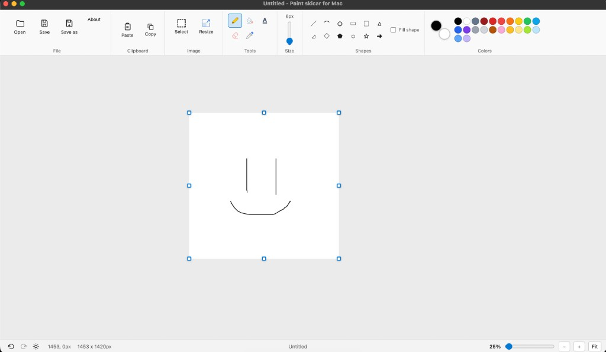

# Paint skicar for Mac

Lightweight Paint style drawing app for macOS. Sketch, select, copy/paste, open images (including Finder **Open With**), and save locally. Dark and light mode. Multi-window.

Everything runs on your Mac — nothing is uploaded anywhere.

## What you get

- Pencil, fill, eraser, color picker, text, and shapes
- Select and move content (mouse or arrow keys), copy / paste / cut, resize
- Open / Save / Save as (PNG, JPEG, WebP)
- Finder **Open With**, drag & drop, multiple windows (`Cmd+N`)
- Zoom, fit-to-view, canvas resize handles
- Dark and light mode

## Screenshot



## Structure

```
PaintSkicarForMac/
  source/          # Electron app (HTML, CSS, JS)
  scripts/         # deploy, run, DMG packaging
  docs/screenshots/
```

## Requirements

- macOS
- Installed app at `/Applications/Paint skicar for Mac.app`
- Node.js (for packing `app.asar` on deploy)

## Usage

Deploy `source/` into the installed app and launch:

```bash
bash scripts/deploy.sh
```

Run without re-packing:

```bash
bash scripts/run.sh
```

Build a shareable DMG:

```bash
bash scripts/package.sh
```

Output: `release/Paint skicar for Mac.dmg` (gitignored — attach to GitHub Releases).

**First open of an unsigned build:** right-click → **Open** (Gatekeeper). After that, normal double-click works.

## Notes

- Not notarized with Apple Developer ID.
- Closing the last window quits the app (`Cmd+Q` behavior).

Vibe coded by Em
